# Exchange Server 安裝完成後的準備工作

## 輸入產品金鑰

- 在 Exchange 系統管理中心中，左邊功能欄選擇伺服器。在右邊內容選擇伺服器，並點選輸入產品金鑰的連結。<br>
  <br>
- 將您的金鑰輸入。<br>
  <br>
- 如果想透過 Exchange Management Shell 輸入也可以，完成後再重啟服務，指令如下。<br>
  ````
  Set-ExchangeServer EX2016 -ProductKey QXYKC-7H87P-XXXXX-XXXXX-XXXXX
  Restart-Service MSExchangeIS
  ````
  <br>
- 完成後會提示需要重新啟動資訊儲存庫服務，重新啟動資訊儲存庫服務。<br>
  <br>
- 重新整理 Exchange 系統管理中心後，就可以看到已獲授權的字樣。<br>
  <br>

## 設定虛擬目錄
Exchange 存取會分內部與外部，內部會依據 Exchange 的作業系統中的電腦名稱作為 FQDN 的一部分，外部預設是空白，需要額外設定。<br>
- 在 Exchange 系統管理中心中，左邊功能欄選擇伺服器。在右邊頁籤選擇虛擬目錄，點選下方圖示設定外部存取網域。<br>
  <br>
- 搭配外部 URL 使用的伺服器選擇中，點選+號，並且選擇 EX2016，最後輸入 Exchange 對外的網域名稱，完成後按確認。<br>
  <br>
- 現在我們可以點開一個虛擬目錄 owa，查看是否確實有將外部網域填入。<br>
  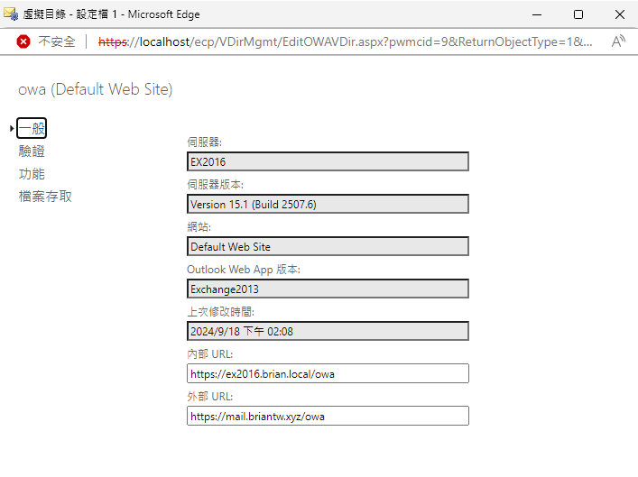<br>
## 設定外部 DNS

| FQDN |  紀錄類型   | 值  |
|  ----  | ----  | ----  |
| mail.briantw.xyz| A Record  | 1.34.xxx.xxx |
| autodiscover.briantw.xyz| CNAME Record  | mail.briantw.xyz |
| briantw.xyz| MX Record  | mail.briantw.xyz |
| briantw.xyz| TXT Record  | v=spf1 ip4:1.34.xxx.xxx ~all |

## 設定憑證
由於在 Exchange 2013 以上的版本，除了自我簽署憑證可以使用介面操作之外，其餘都會需要透過 Exchange Management Shell。<br>
- 開啟 Exchange Management Shell，並且準備好公開憑證，這個公開憑證必須要包含伺服器根憑證與私鑰，否則會無法使用。<br>
- 輸入 `Import-ExchangeCertificate -FileData ([System.IO.File]::ReadAllBytes('憑證PFX路徑')) -Password (ConvertTo-SecureString -String '密碼' -AsPlainText -Force)` 之後，可以看到憑證成功匯入的畫面。<br>
  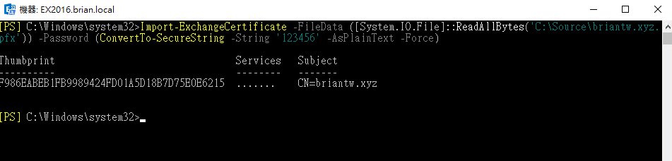<br>
- 回到 Exchange 系統管理中心中，左邊功能欄選擇伺服器。在右邊頁籤選擇憑證，可以看到剛剛匯入成功的憑證資訊。<br>
  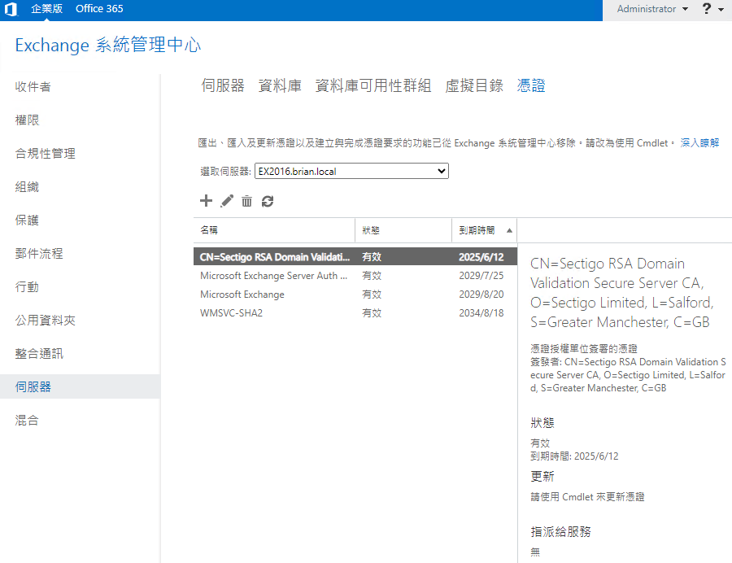<br>
- 編輯此憑證，點選服務功能，將SMTP、IIS 功能勾選，完成後儲存，這當中會出現提醒，提醒你要覆寫現有的預設 SMTP 憑證，點選是即可。<br>
   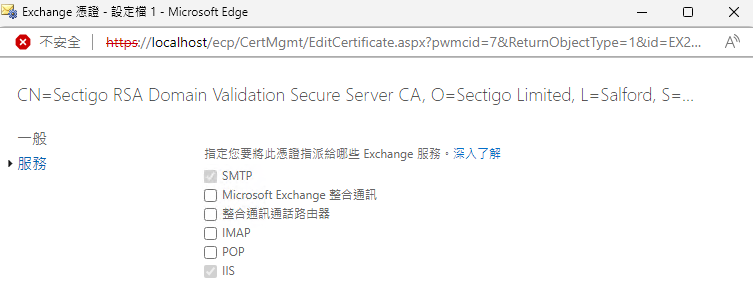<br>
   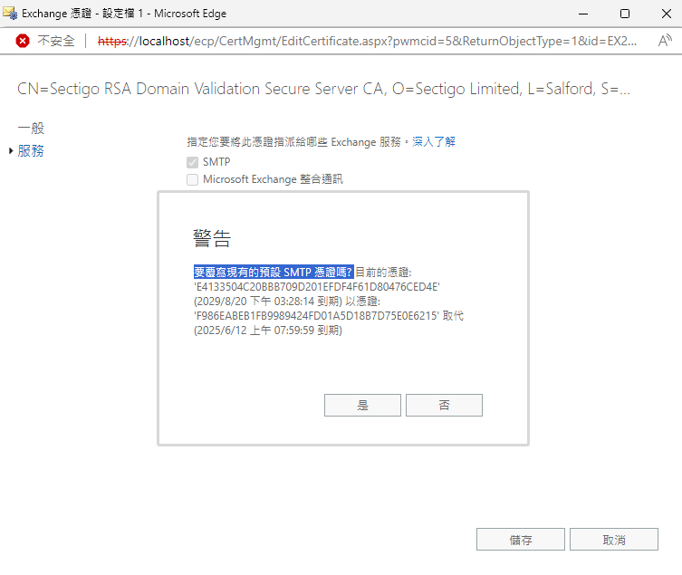<br>
- 在 Exchange Management Shell 重新啟動 IIS 服務，指令如下。<br>
  ````
  	net stop WAS
    net start W3SVC
  ````
  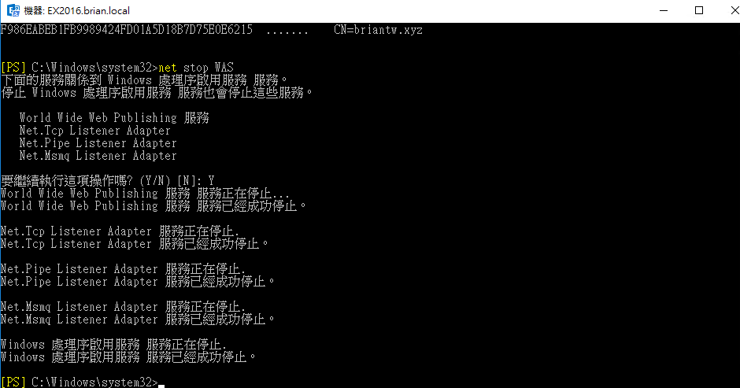<br>
  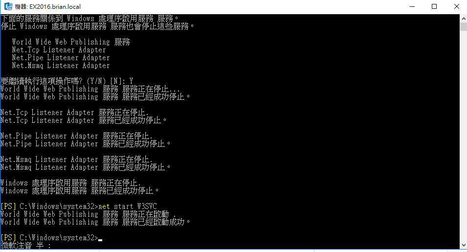<br>

- 在瀏覽器輸入 https://mail.briantw.xyz/ecp?ExchClientVer=15 驗證憑證是否有辨認到。<br>
  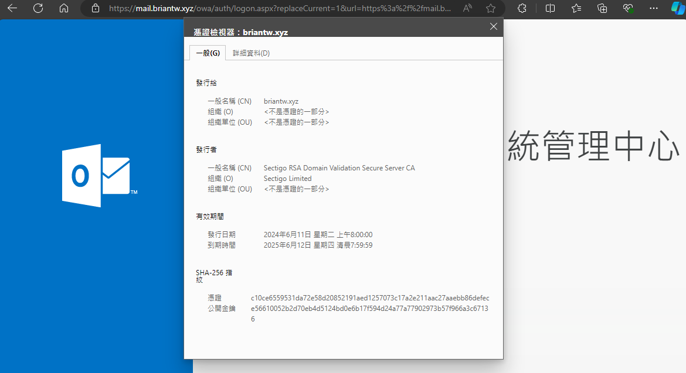<br>

## 郵件流程設定

- 在 Exchange 系統管理中心中，左邊功能欄選擇郵件流程。在右邊頁籤選擇公認網域，點選+號新增外部網域，輸入公認網域然後選擇權威，儲存。<br>
  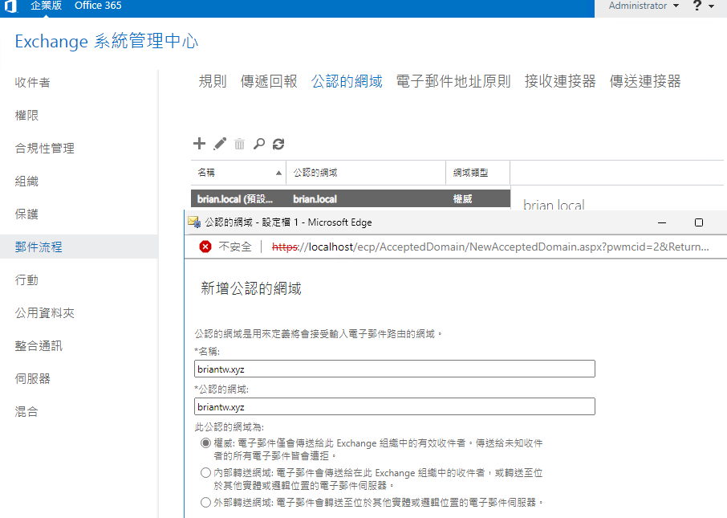<br>
- 在右邊頁籤選擇傳送連接器，點選+號新增傳送連接器。<br>
  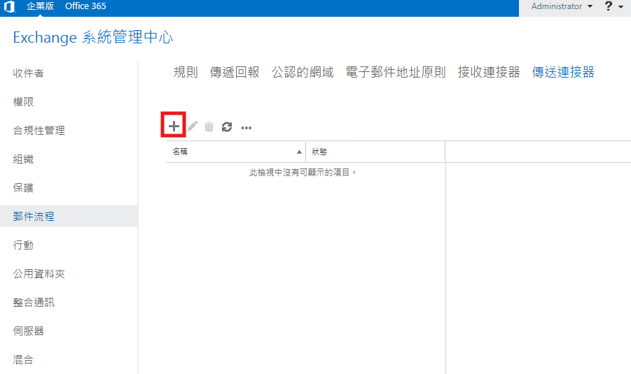<br>
- 輸入連接器名稱，類型選擇網際網路，點選下一步。<br>
  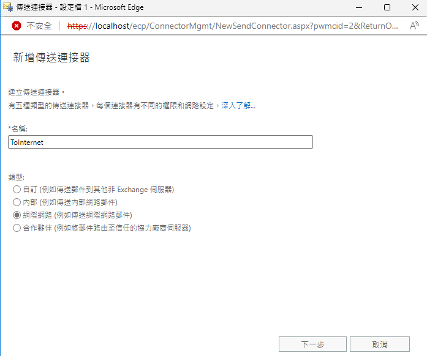<br>
- 選擇與收件者網域關聯的 MX 紀錄，點選下一步。<br>
  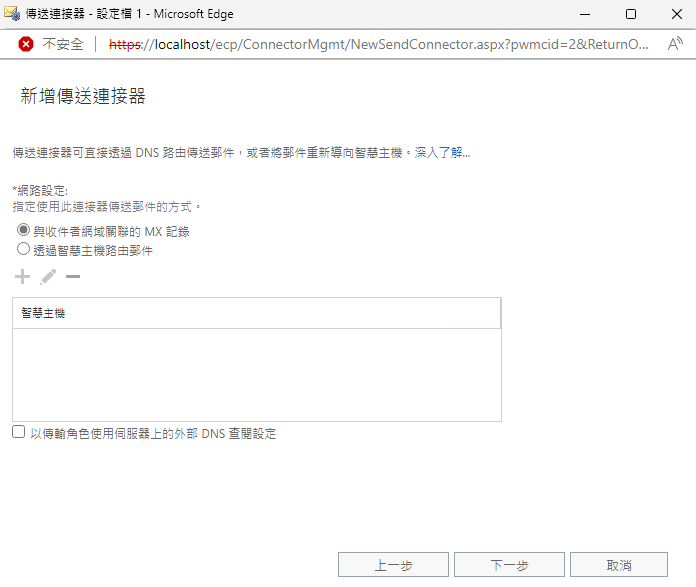<br>
- 點選+號新增位址空間，在完整網域空間的欄位填入 *，代表可以寄給任何網域。點選儲存在按下一步。<br>
  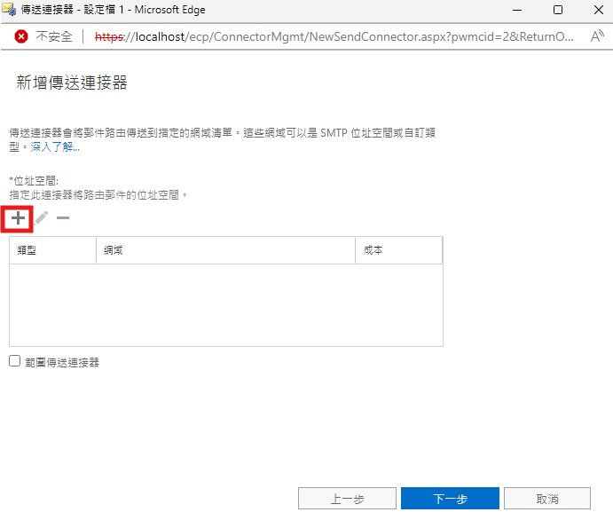<br>
  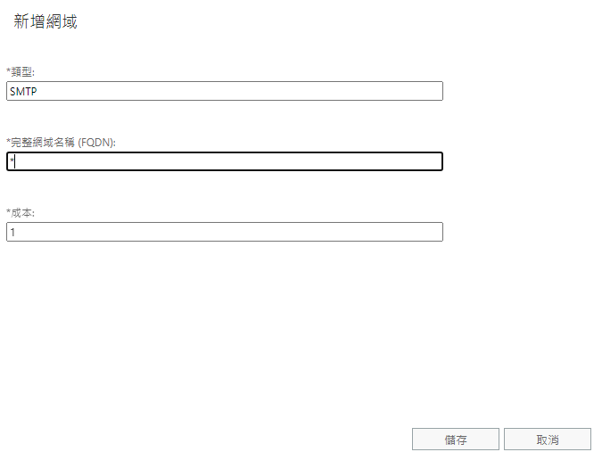<br>
- 點選+號，選擇來源伺服器。<br>
  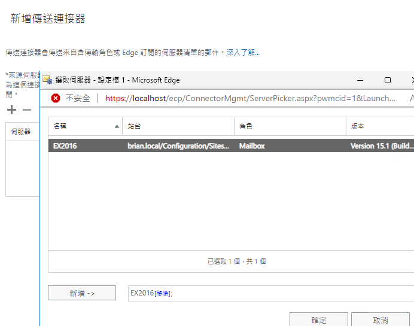<br>
- 點選完成，完成傳送連接器設定。<br>
  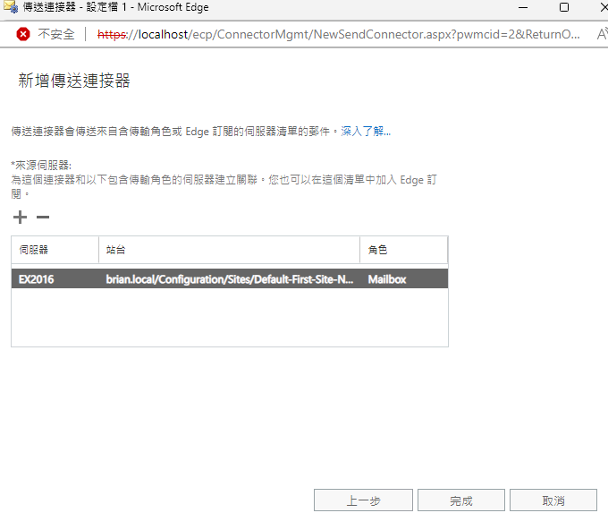<br>
- 完成設定後，也將紀錄開啟。<br>
  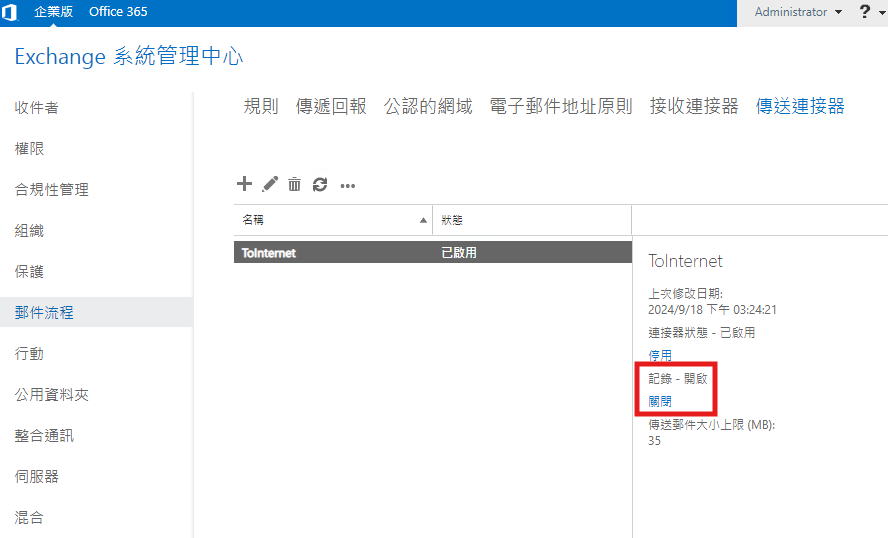<br>
  
## 設定完這些組態設定，要驗證是

- 信件收寄是否正常。<br>
- 使用者是否可以登入 Outlook 並且收發信件。<br>

完成上述的設定基本上就可以使用，當然還有許多可以設定的功能，就會依據客戶需求去設定了。此篇說明文章結束<br>